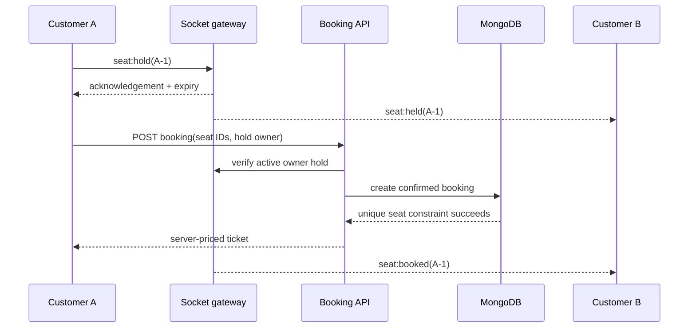

# Booking sequence

```mermaid
sequenceDiagram
  participant A as Customer A
  participant S as Socket gateway
  participant API as Booking API
  participant DB as MongoDB
  participant B as Customer B
  A->>S: seat:hold(A-1)
  S-->>A: acknowledgement + expiry
  S-->>B: seat:held(A-1)
  A->>API: POST booking(seat IDs, hold owner)
  API->>S: verify active owner hold
  API->>DB: create confirmed booking
  DB-->>API: unique seat constraint succeeds
  API-->>A: server-priced ticket
  S-->>B: seat:booked(A-1)
```
