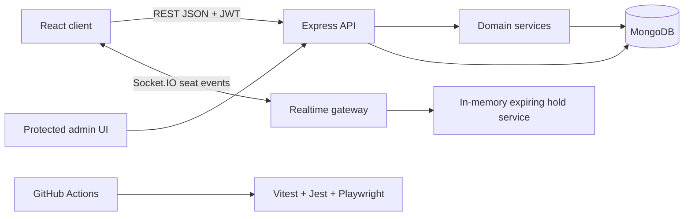

# Component architecture

```mermaid
flowchart LR
  Browser[React client] -->|REST JSON + JWT| API[Express API]
  Browser <-->|Socket.IO seat events| Socket[Realtime gateway]
  API --> Services[Domain services]
  Socket --> Holds[In-memory expiring hold service]
  Services --> Mongo[(MongoDB)]
  API --> Mongo
  Admin[Protected admin UI] --> API
  CI[GitHub Actions] --> Tests[Vitest + Jest + Playwright]
```

The server remains authoritative for authentication, prices, availability and booking creation. The client never submits a trusted total.
