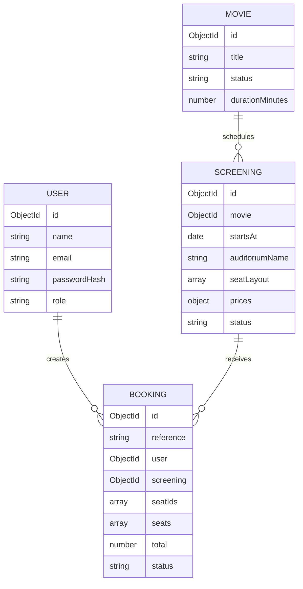

# Data model

```mermaid
erDiagram
  USER ||--o{ BOOKING : creates
  MOVIE ||--o{ SCREENING : schedules
  SCREENING ||--o{ BOOKING : receives
  USER { ObjectId id string name string email string passwordHash string role }
  MOVIE { ObjectId id string title string status number durationMinutes }
  SCREENING { ObjectId id ObjectId movie date startsAt string auditoriumName array seatLayout object prices string status }
  BOOKING { ObjectId id string reference ObjectId user ObjectId screening array seatIds array seats number total string status }
```

Confirmed bookings use a partial unique multikey index on screening plus seat ID, providing the final race-condition guard beyond live holds.
